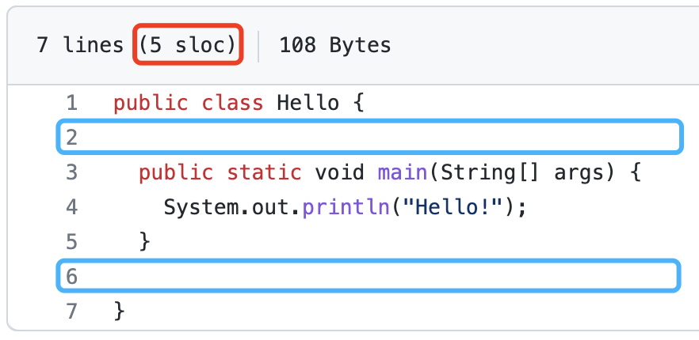

# 软件质量
软件质量如何保证？一定有科学的方法。

> 软件度量元（Software Metrics）是一种用于衡量软件的测量方法。软件度量元的目的是通过测量软件的一些特定特征来评估软件的质量和可维护性。
> 软件度量元可以测量软件的多种特征，例如：
> 软件的大小：这可以通过测量软件中的代码行数、文件数、类数等来衡量。
> 软件的复杂度：这可以通过测量软件中的函数数、变量数、分支数等来衡量。
> 软件的质量：这可以通过测量软件的错误率、可读性、可维护性等来衡量。
> 软件度量元是一种重要的工具，可以帮助软件开发人员评估软件的质量并进行优化，也可以帮助软件使用者评估软件的可靠性和适用性。

## 度量元

|名称|英文缩写|类型|解释|详解|
|--|--|--|--|--|
|圈复杂度|STCYC|方法|Cyclomatic Complexity ：圈复杂度 （也称为条件复杂度,是一种代码复杂度的衡量标准）|圈复杂度计算为决策数加1。（if条件/case条件等数量+1）圈复杂度高：表明模块化不足或一个函数中的逻辑太多。软件度量研究表明，圈复杂度大于10的函数往往存在与它们的复杂性有关的问题。|
|代码行数|[LOC](LOC.md)|文件|lines of code|代码行数|
|源代码行数|SLOC|文件|source lines of code|源代码行数简称SLOC，也称为程序行数，简称LOC，是由计算程序源代码的行数来估计计算机程序大小的软件度量。源代码行数一般会用来预计开发程序需要的人力及时间，若在软件完成后，也可以用来估计程序开发生产力或可维护性。|
|继承深度|STNOC|类|Depth of Inheritance|Depth of Inheritance|

### 名词

|中文|英文|
|---|---|
|软件测量|software measurement|
|软件度量|software metric|
